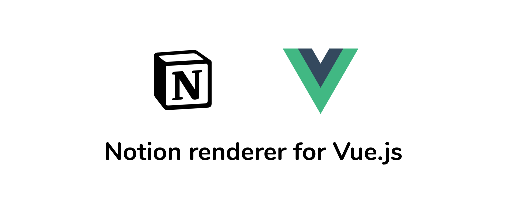

# vue-notion-render
### 📜 Vue Renderer for Notion pages.



[NPM](https://www.npmjs.com/package/vue-notion-render)


# Features

- Supports The [Official Notion API](https://developers.notion.com/reference/intro)
- Supports [notion-api-worker](https://github.com/splitbee/notion-api-worker) to render unsupported blocks of the Official API created by [@splitbee](https://github.com/splitbee)
- Fast
- Customizable

# Install

```bash
npm install vue-notion-render --save
```

## Vue.js

in `src/index.js` file import the component and use Vue.component method.

```js
    import Vue from "vue"
    import VueNotionRender from "vue-notion-render"
    Vue.component('VueNotionRender', VueNotionRender)
```

## Nuxt.js

in order to use it with Nuxt.js create a Nuxt plugin.

1. in `/plugins` directory create a file `vue-notion-render.js`

   ```js
   import VueNotionRender from 'vue-notion-render'
   import Vue from 'vue'
   Vue.component('VueNotionRender', VueNotionRender)
   ```

2. Register the plugin by adding the file in `nuxt.config.js` plugins array

   ```js
       plugins: ['~/plugins/vue-notion-render.js']
   ```

### Local Component

if you don't want to register the component globally you can use it locally in your component.

```js
    <script>
         import VueNotionRender from "vue-notion-render"
         ...
         export default {
                 components: {
                     VueNotionRender,
                 },
         ...
     </script>
```

# Usage

This package doesn't handle the communication with the API, therefore to learn more about the official API check out the [official documentation](https://developers.notion.com/reference/intro).

Currently the Official API doesn't support all Notion blocks, a temporary solution is to use [notion-api-worker](https://github.com/splitbee/notion-api-worker) a serverless wrapper for the private Notion API.

## Using notion-api-worker

- Use the /v1/page/:id to retrieve page blocks
- **Make sure to pass :unofficial="true"** prop

```vue
<template>
  <vue-notion-render :unofficial="true" :data="data" />
</template>

<script>
...js
export default {
    ...
    data() {
        return {
        data: {}
        };
    },
    async created() {
        try {
            const data = await fetch("https://beta.notiontoblog.workers.dev/v1/page/f36a63918d1246909206813dcec928ea")
            this.data = await data.json()
        }catch(err){
            console.log(err)
        }
    }
};
</script>
```

## Using The official API

https://developers.notion.com/reference/get-block-children

- Retrieve block children and **pass the results array to data**
- **Make sure to pass :unofficial="false"** prop

```vue
<template>
  <vue-notion-render :unofficial="false" :data="data" />
</template>

<script>
...
export default {
    ...
    data() {
        return {
            data: []
        };
    },
    async created() {
        // Retrieve block children and pass the results array to data
        // https://developers.notion.com/reference/get-block-children
    }
};
</script>
```

# Supported Blocks

| Block Type      | Supported | Notion-API-Worker | Official API | Note                                                                                     |
| --------------- | --------- | ----------------- | ------------ | ---------------------------------------------------------------------------------------- |
| paragraph       | ✅        | ✅                | ✅           |                                                                                          |
| Headings        | ✅        | ✅                | ✅           |                                                                                          |
| To-do           | ✅        | ✅                | ✅           |                                                                                          |
| Lists           | ✅        | ✅                | ✅           |                                                                                          |
| Toggle          | ✅        | ✅                | ✅           |                                                                                          |
| Quote           | ✅        | ✅                | ❌           |                                                                                          |
| Colors          | ✅        | ✅                | ✅           |                                                                                          |
| Highlight       | ✅        | ✅                | ✅           |                                                                                          |
| Divider         | ✅        | ✅                | ❌           |                                                                                          |
| Callout         | ✅        | ✅                | ❌           |                                                                                          |
| Emojis          | ✅        | ✅                | ✅           |                                                                                          |
| Inline Equation | ✅        | ✅                | ✅           |                                                                                          |
| Block Equation  | ✅        | ✅                | ❌           |                                                                                          |
| Code            | ✅        | ✅                | ❌           |                                                                                          |
| Bookmark        | ✅        | ✅                | ❌           |                                                                                          |
| Embeds          | ✅        | ✅                | ❌           | Spotify, Twitter, Maps, Figma, Pdf, Codepen, TypeForm, Replit, Youtube, Whimsical, Drive |
| Layout          | ✅        | ✅                | ❌           |                                                                                          |
| Video           | ✅        | ✅                | ❌           | embed                                                                                    |
| Audio           | ✅        | ✅                | ❌           | embed                                                                                    |
| File            | ✅        | ✅                | ❌           | embed                                                                                    |
| Table           | ❌        | ❌                | ❌           | soon                                                                                     |
| Board           | ❌        | ❌                | ❌           | soon                                                                                     |

## Custom Blocks

vue-notion-render let you use customized components to render some blocks, to do that 

### 1. Register Components globally

Vue.js  in `main.js` file register the components

```jsx
import Vue from "vue";
import Component1 from "../components/component1.vue";
import Component2 from "../components/component2.vue";

Vue.component("Component1", Component1);
Vue.component("Component2", Component2);
```

Nuxt.js

1.create a plugin in `/plugins` directory and name it `components.js`

```jsx
import Vue from "vue";
import Component1 from "../components/component1.vue";
import Component2 from "../components/component2.vue";

Vue.component("Component1", Component1);
Vue.component("Component2", Component2);
```

2- Register the plugin by adding the file in `nuxt.config.js` plugins array

```jsx
plugins: ['~/plugins/components.js']
```

### 2. Create Customized block array

You need to create an array of objects that contains `blockId` and `componentName` like this

```jsx
data() {
    return {
      customBlocks: [
        {
          blockId: "fe30b1ce-84a7-47b3-abe1-b3448b989115",
          componentName: "Component1"
        },
        {
          blockId: "305fed49-f7e8-412f-80a1-b32e2bbd5a01",
          componentName: "Component2"
        }
      ]
    };
  },
```

### 3. Pass the array to `custom` prop

You need to pass the customized block array to `custom` prop

```jsx
<VueNotionRender :unofficial="true" :data="blocks" :custom="customBlocks" />
```

### 4. Accept `block` prop in your component

to have the block data you need to accept `block` prop in your component

```jsx
<script>
export default {
  props: {
    block: Object,
  },
};
</script>
```

# Credits

Created By [@yudax](https://twitter.com/_yudax)
